# BASES DE DATOS
## 3 semestre
**Alumna:** Querén Mercado Bernardino.
**Docente:** Marisol Juárez.

# TAREA 1.1
Crear una base de datos llamada *escuela* y dentro de ella crea 3 tablas diferentes. 
Las tablas deben llevar por nombre: **estudiante, profesor, materia.**
Para cada columna define las columnas que consideres necesarias, con un máximo de 5 y un mínimo de 2.

- **Paso 1**. Abro MySQL 8.0 Command Line e ingreso mi contraseña.
  
- **Paso 2**. Utilizo SHOW DATABASES para ver las bases de datos existentes.
  
 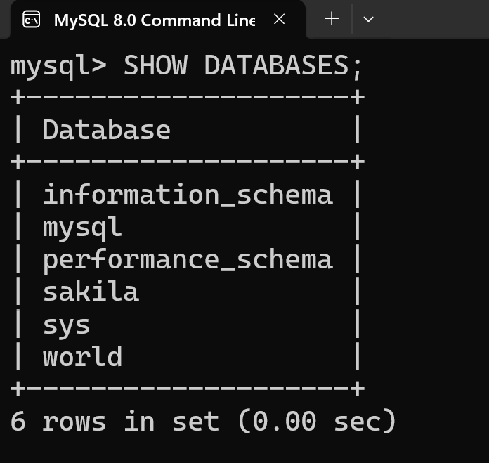

- **Paso 3**. Creo una nueva base de datos llamada *escuela* usando CREATE DATABASE escuela.
  Posteriormente, utilizaré USE escuela para posicionarme en esa base de datos y trabajar en ella las tres tablas.
  - Creo primero la **tabla de estudiante** que tendrá las características de: **matrícula, nombre, semestre y correo** y mediante DESC estudiante la visualizo.
    
 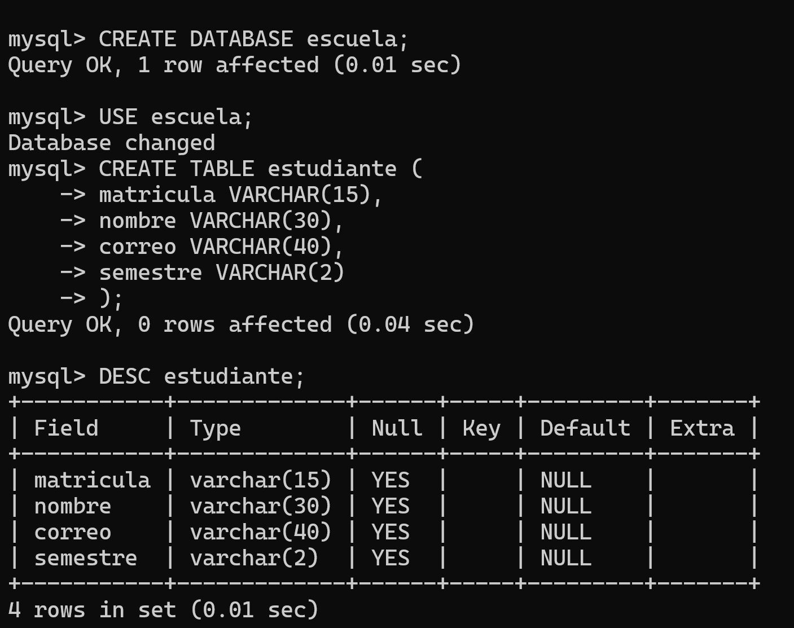

- **Paso 4**. Procedo a repetir este procedimiento con la **tabla profesor** mediante CREATE TABLE *nombre tabla* (-las filas-). Esta tendrá las características de: **correo, cédula, nombre, horas_clase** y mediante DESC profesor la visualizo.
  
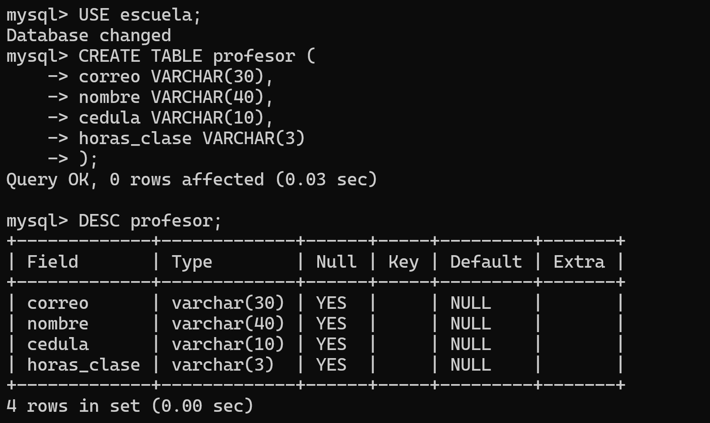

- **Paso 5**. Procedo a repetir este procedimiento con la **tabla materia** mediante CREATE TABLE *nombre tabla* (-las filas-). Esta tendrá las características de: **ID_de_materia, nombre, semestre, horas_totales** y mediante DESC materia la visualizo.
  
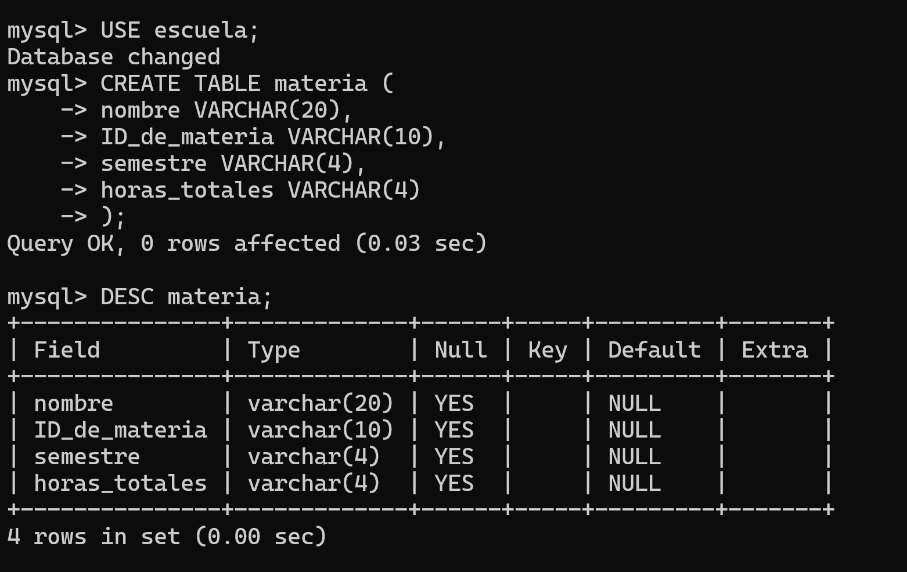

- **Paso 6.** Finalmente, utilizo "SHOW TABLES" para ver las tablas que se encuentran dentro de mi base de datos: "escuela".
  
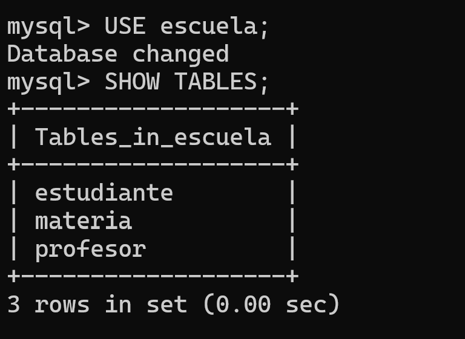

- Y ahora, si nuevamente hago SHOW DATABASES, nuestra nueva bases de datos : "escuela" aparecerá también.
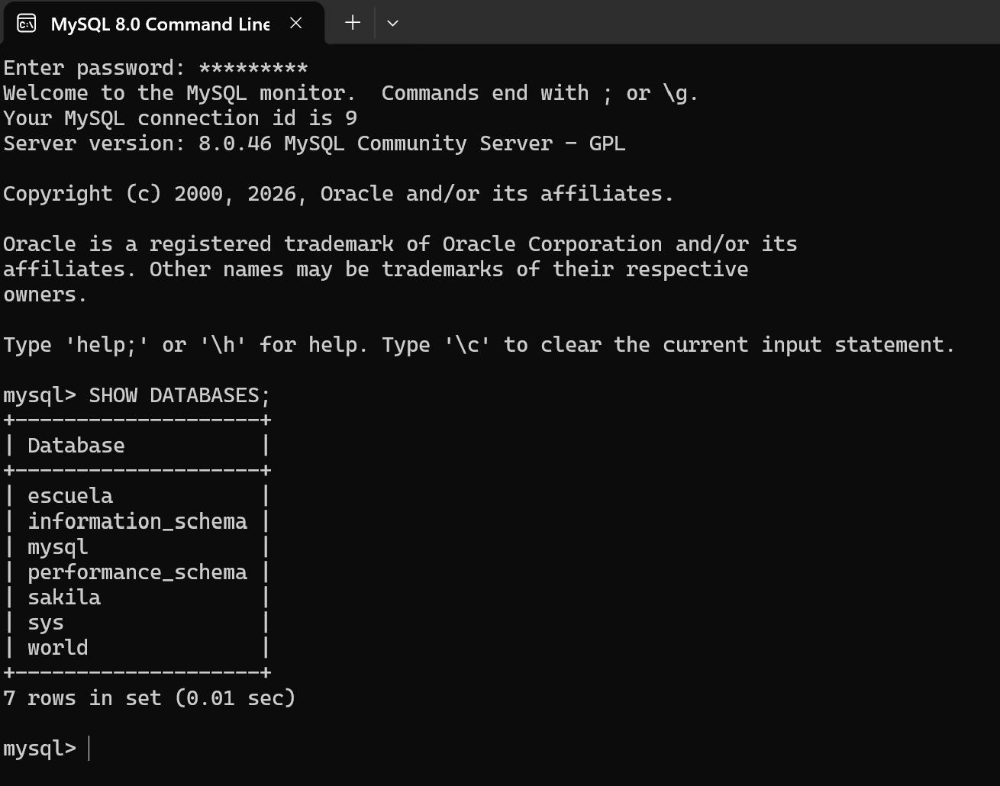

### CÓDIGO UTILIZADO EN MYSQL DURANTE LA PRÁCTICA
```mysql
mysql> SHOW DATABASES;
+--------------------+
| Database           |
+--------------------+
| information_schema |
| mysql              |
| performance_schema |
| sakila             |
| sys                |
| world              |
+--------------------+
6 rows in set (0.00 sec)

mysql> CREATE DATABASE escuela;
Query OK, 1 row affected (0.01 sec)

mysql> USE escuela;
Database changed

mysql> CREATE TABLE estudiante (
    -> matricula VARCHAR(15),
    -> nombre VARCHAR(30),
    -> correo VARCHAR(40),
    -> semestre VARCHAR(2)
    -> );
Query OK, 0 rows affected (0.04 sec)

mysql> DESC estudiante;
+-----------+-------------+------+-----+---------+-------+
| Field     | Type        | Null | Key | Default | Extra |
+-----------+-------------+------+-----+---------+-------+
| matricula | varchar(15) | YES  |     | NULL    |       |
| nombre    | varchar(30) | YES  |     | NULL    |       |
| correo    | varchar(40) | YES  |     | NULL    |       |
| semestre  | varchar(2)  | YES  |     | NULL    |       |
+-----------+-------------+------+-----+---------+-------+
4 rows in set (0.01 sec)

mysql> USE escuela;
Database changed

mysql> CREATE TABLE profesor (
    -> correo VARCHAR(30),
    -> nombre VARCHAR(40),
    -> cedula VARCHAR(10),
    -> horas_clase VARCHAR(3)
    -> );
Query OK, 0 rows affected (0.03 sec)

mysql> DESC profesor;
+-------------+-------------+------+-----+---------+-------+
| Field       | Type        | Null | Key | Default | Extra |
+-------------+-------------+------+-----+---------+-------+
| correo      | varchar(30) | YES  |     | NULL    |       |
| nombre      | varchar(40) | YES  |     | NULL    |       |
| cedula      | varchar(10) | YES  |     | NULL    |       |
| horas_clase | varchar(3)  | YES  |     | NULL    |       |
+-------------+-------------+------+-----+---------+-------+
4 rows in set (0.00 sec)

mysql> USE escuela;
Database changed

mysql> CREATE TABLE materia (
    -> nombre VARCHAR(20),
    -> ID_de_materia VARCHAR(10),
    -> semestre VARCHAR(4),
    -> horas_totales VARCHAR(4)
    -> );
Query OK, 0 rows affected (0.03 sec)

mysql> DESC materia;
+---------------+-------------+------+-----+---------+-------+
| Field         | Type        | Null | Key | Default | Extra |
+---------------+-------------+------+-----+---------+-------+
| nombre        | varchar(20) | YES  |     | NULL    |       |
| ID_de_materia | varchar(10)  | YES  |     | NULL    |       |
| semestre      | varchar(4)  | YES  |     | NULL    |       |
| horas_totales | varchar(4)  | YES  |     | NULL    |       |
+---------------+-------------+------+-----+---------+-------+
4 rows in set (0.00 sec)

mysql> USE escuela;
Database changed

mysql> SHOW TABLES;
+-------------------+
| Tables_in_escuela |
+-------------------+
| estudiante        |
| materia           |
| profesor          |
+-------------------+
3 rows in set (0.00 sec)

mysql>
```

## IMAGEN DEL PROCEDIMIENTO COMPLETO EN MYSQL 
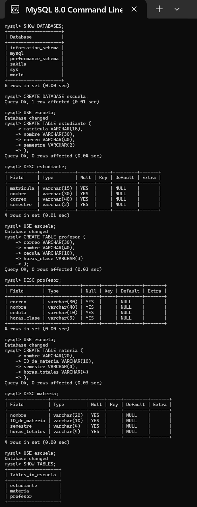


# TAREA 1.2
1. Creación de mi nuevo Repositorio en Git Hub (*Bases_DeDatos_QMB*).
    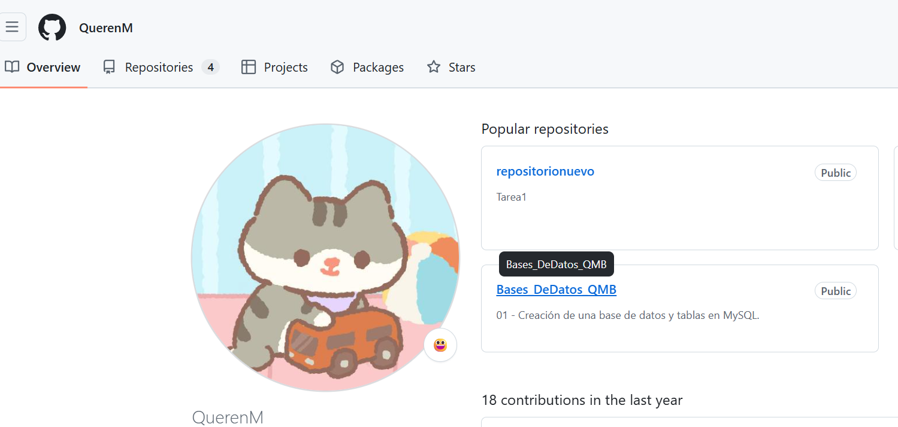
2.  Agregar archivo README.md.
     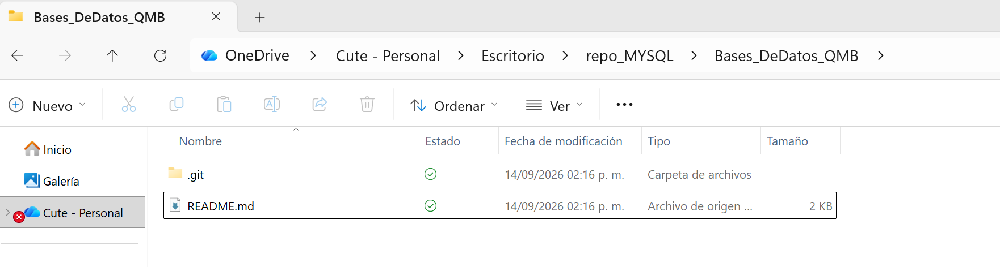
     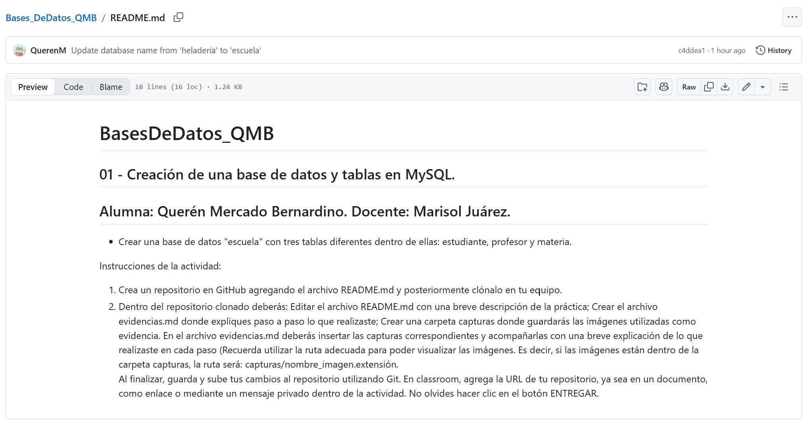
2. Clonación de mi repositorio *"Bases_DeDatos_QMB"* en mi equipo.
   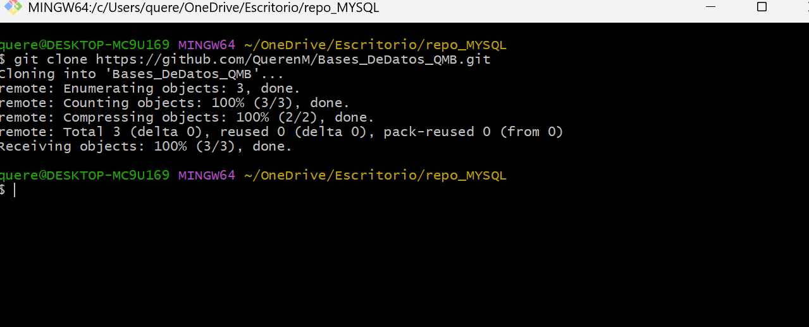
3. Edito mi archivo README directamente desde Visual Studio Code, de manera local.
   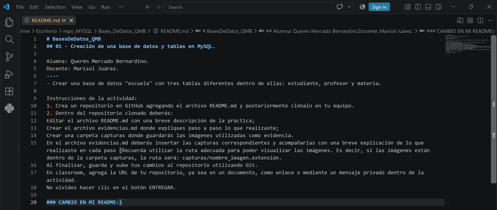
4. Subo los cambios a mi repositorio remoto mediante Git Bash y visualizo las modificaciones.
   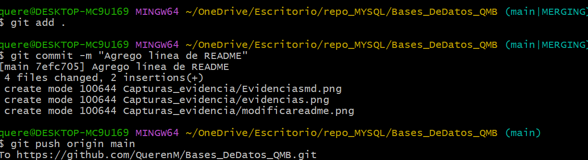
   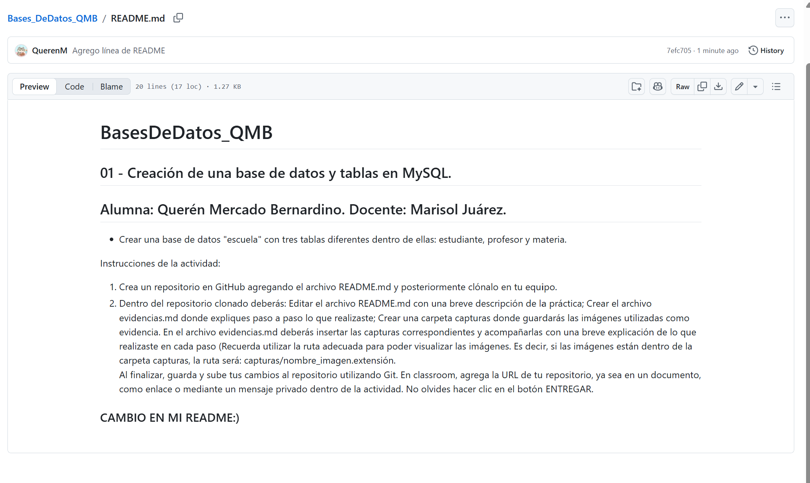
6. Creo una carpeta llamada *"Capturas_evidencia"* donde se encuentran las imágenes de cada paso de la prática.
   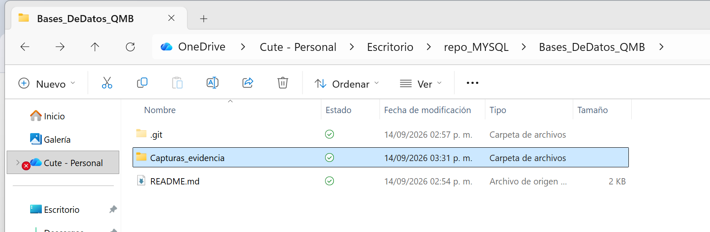
  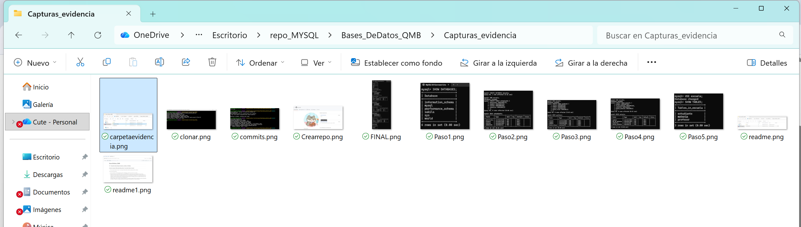
7. Hago git push origin main para subir mis avances locales hasta el momento.
    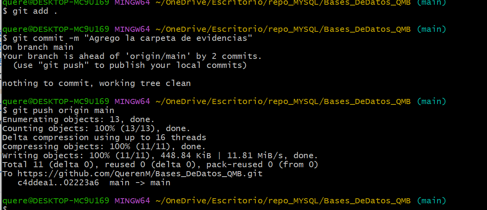
8. Creo el archivo Evidencias.md (este mismo) donde explico paso a paso el procedimiento realizado acompañado de las capturas de mi carpeta.
   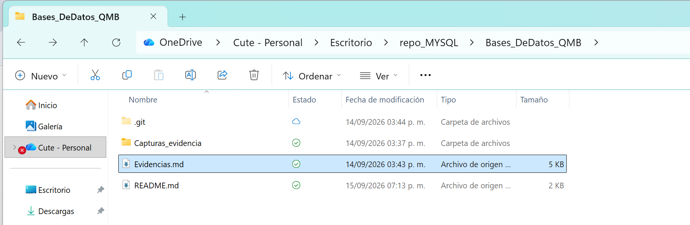

9. Hago un último push origin para asegurarme de subir todos los cambios.
 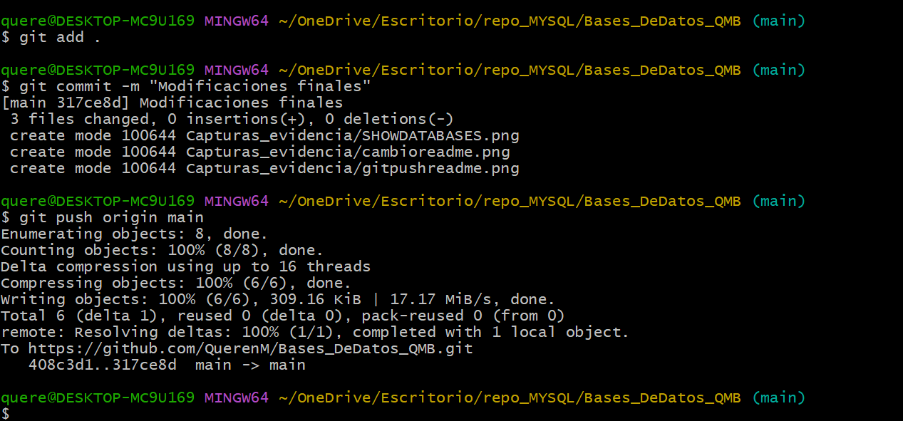


